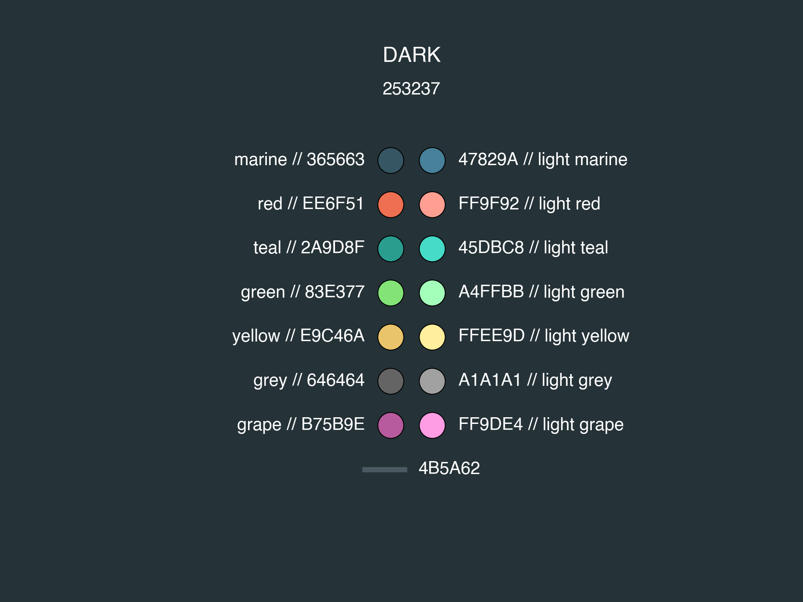
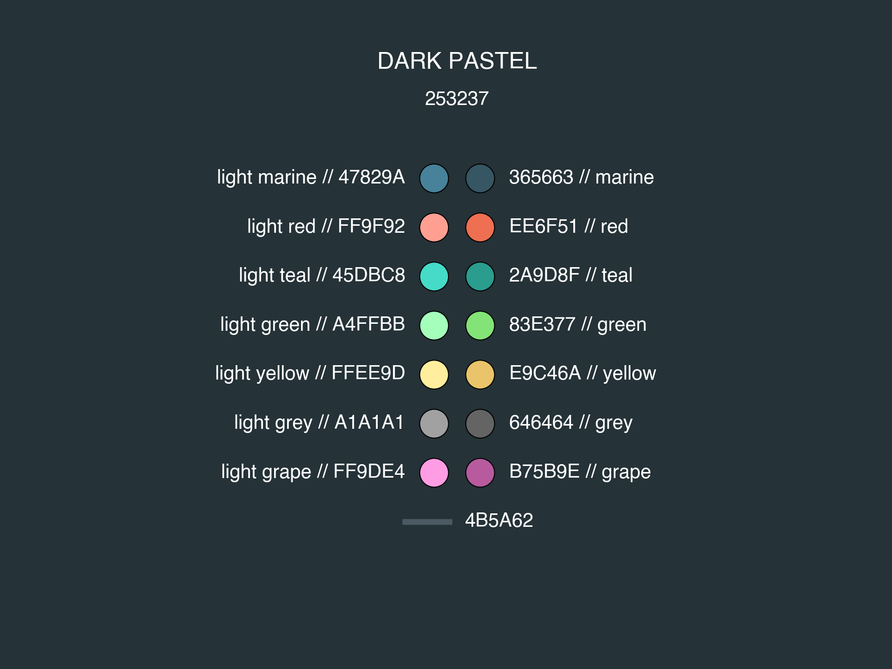
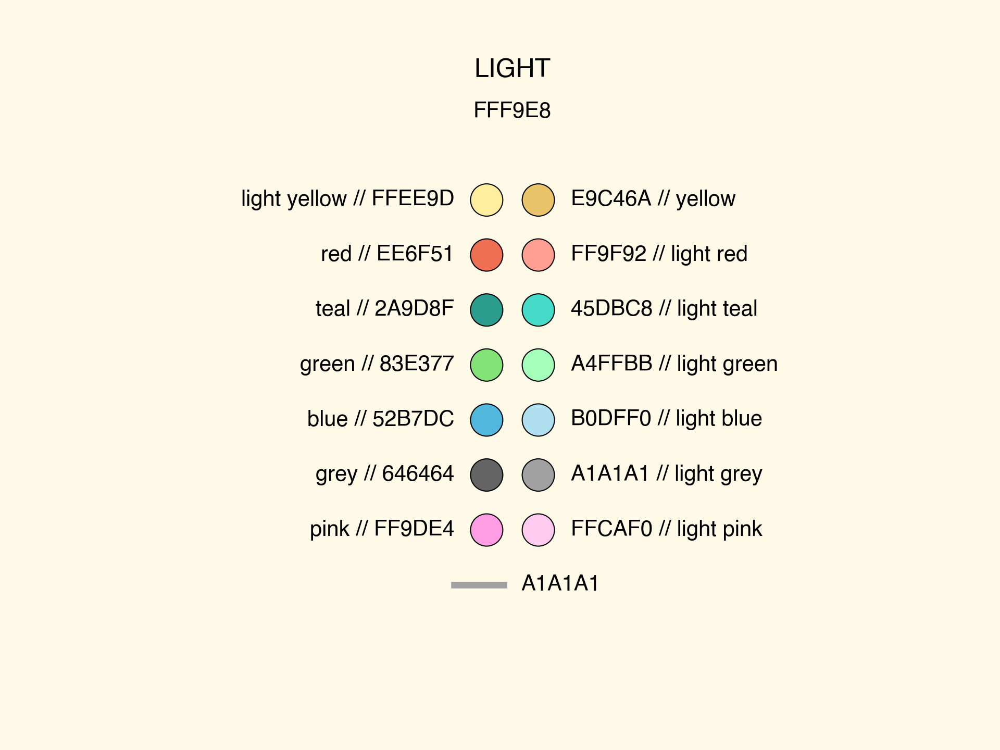
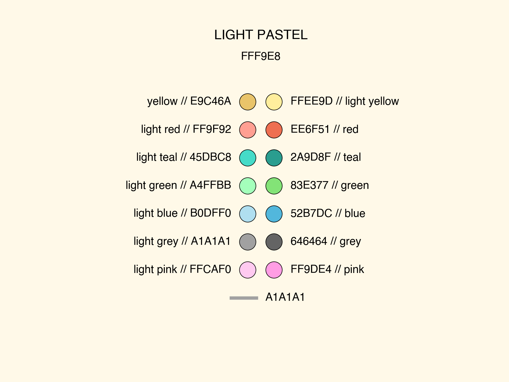
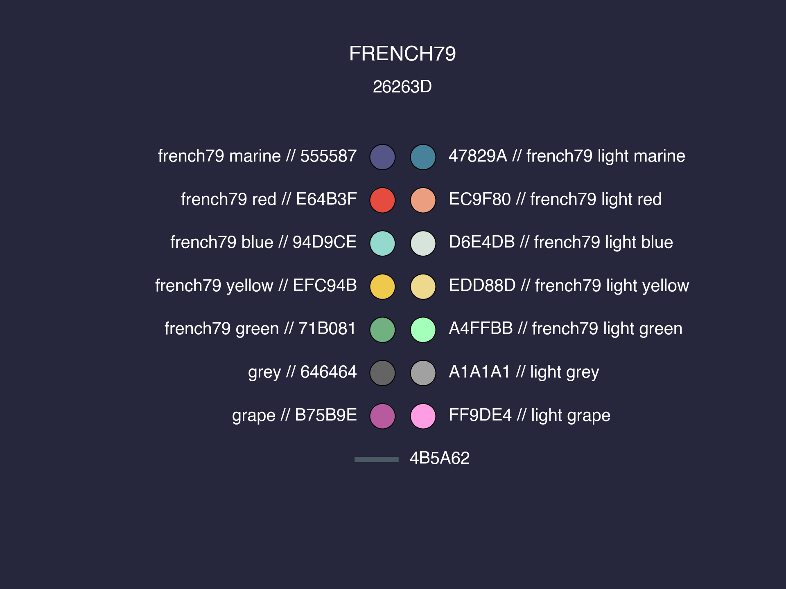
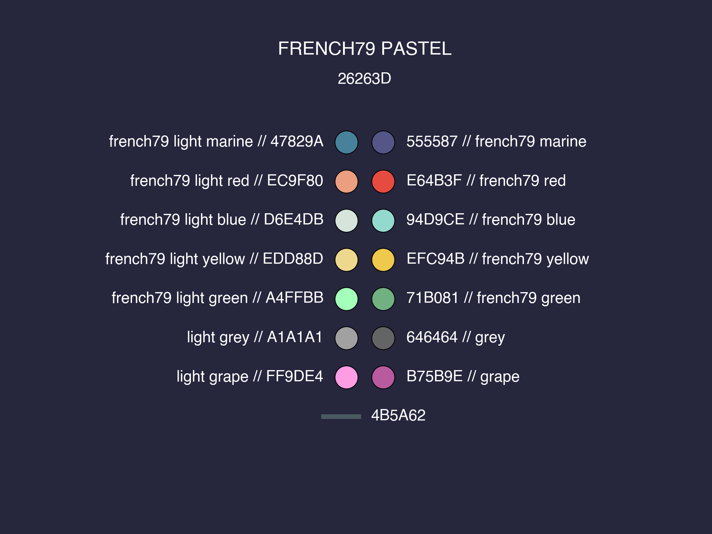
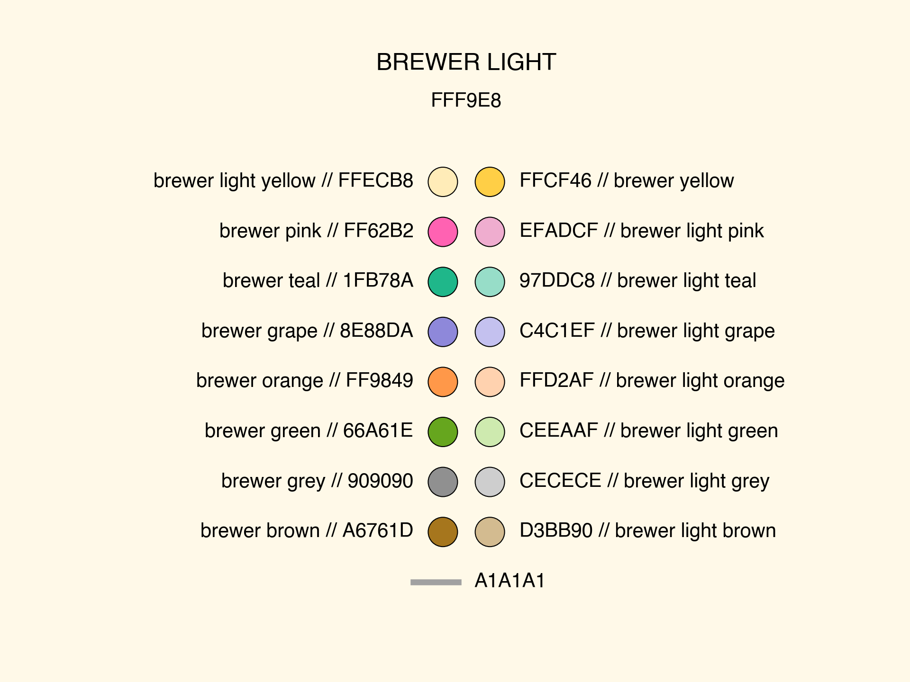
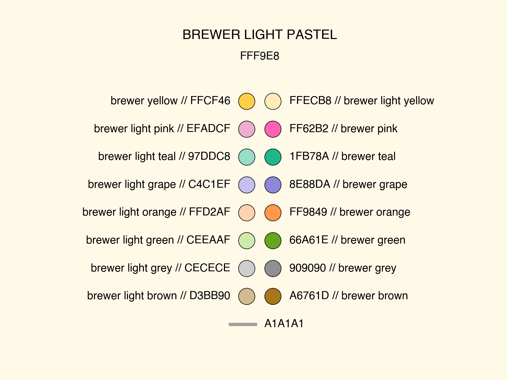
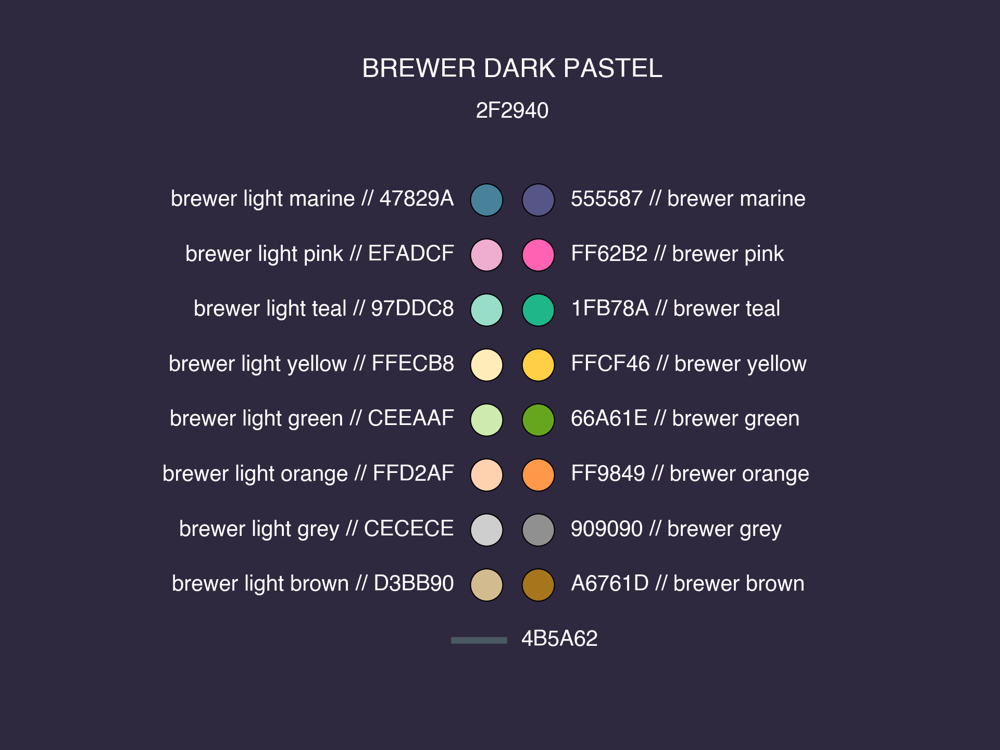

Color Handling
==============

The :mod:`epipack.colors` module provides
a large collection of colors and palettes
that can used for visualizations and plots

Colors 
------

The dictionary

- ``hex_colors``

maps color names to hex codes.

The dictionary

- ``colors``

maps color names to rgb tuples (in [0,255]).

Every color is associated with an accompanying
lighter or darker version of itself. The
dictionary

- ``accompanying_color``

maps color names to their respective counterparts.

Palettes
--------

Palettes are lists of color names.
The dictionary 

- ``palettes``

maps palette names to such lists
of color names.

Every palette is associated with 
a link color and a back ground color.
These are encoded in 

- ``hex_bg_colors``, and
- ``hex_link_colors``

as well as 

- ``bg_colors`` and
- ``link_colors``

for the rgb tuple version.

You can load palettes like this:

.. code:: python

    from epipack.colors import hex_colors, colors, palettes

    pal_name = 'dark'
    these_hex_colors = [ hex_colors[col] for col in palettes[pal_name] ]
    these_rgb_colors = [ colors[col] for col in palettes[pal_name] ]
    
These are all available palettes:

.. code:: python

    >>> palettes['dark']

.. code:: python

    >>> palettes['dark pastel']

.. code:: python

    >>> palettes['light']

.. code:: python

    >>> palettes['light pastel']

.. code:: python

    >>> palettes['french79']

.. code:: python

    >>> palettes['french79 pastel']

.. code:: python

    >>> palettes['brewer light']

.. code:: python

    >>> palettes['brewer light pastel']

.. code:: python

    >>> palettes['brewer dark']

.. image:: color_media/08.png
    :width: 70%

.. code:: python

    >>> palettes['brewer dark pastel']

