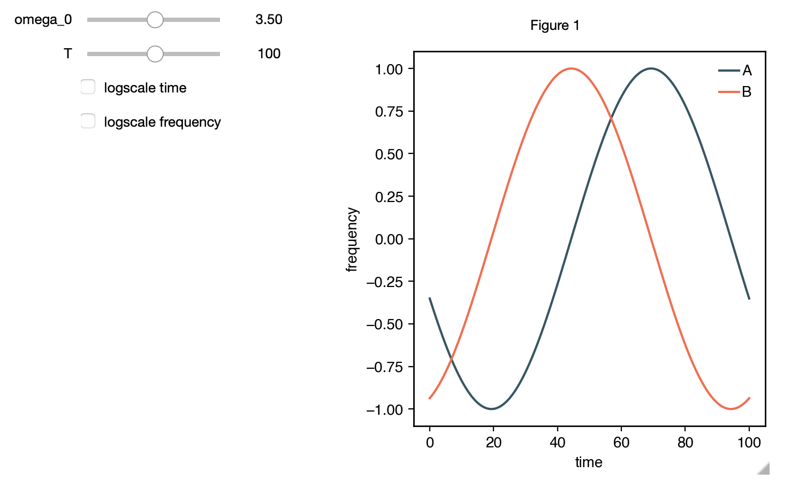

Interactive Integrations
========================

Immediate feedback on the influence of parameter changes
is a powerful mechanism to understand a system's inner workings
in a fast manner. `epipack` therefore offers an interactive widget 
for Jupyter
notebooks where parameter values can be changed with sliders
and the influence on system trajectories is shown immediately.

Example: SIRS Model
-------------------

The most efficient way to define a model for which parameter
values can be changed on the fly is by using a
:class:`epipack.symbolic_epi_models.SymbolicEpiModel` (c.f. the
class' method
:func:`epipack.symbolic_epi_models.SymbolicMixin.set_parameter_values`).

Also, we need the interactive integrator class and two range classes,
one for linear sliders and one for log slides.

Last but not least, tell the jupyter notebook to render matplotlib 
figures as widgets.

.. code:: python

    from epipack import SymbolicEpiModel
    from epipack.interactive import InteractiveIntegrator, Range, LogRange
    import sympy
    %matplotlib widget

Now, we need to define the symbols needed for the SIRS model.

.. code:: python

    S, I, R, R0, tau, omega = sympy.symbols("S I R R_0 tau omega")

Having done that, we can define the model (with initial conditions)

.. code:: python

    I0 = 0.01
    model = SymbolicEpiModel([S,I,R])\
             .set_processes([
                    (S, I, R0/tau, I, I),
                    (I, 1/tau, R),
                    (R, omega, S),
                ])\
             .set_initial_conditions({S:1-I0, I:I0})

Here, the basic reproduction number :math:`R_0`, the infectious
period :math:`\tau`, and the waning immunity rate :math:`\omega`
are parameters of the system. Let's say we're interested
in how the system changes its behavior when :math:`R_0` and :math:`\tau`
are varied and :math:`\omega` is kept fixed.

We define:

.. code:: python

    parameters = {
        R0: LogRange(min=0.1,max=10,step_count=1000),
        tau: Range(min=0.1,max=10,value=8.0),
        omega: 1/14
    }

Here, ``LogRange`` lets :math:`R_0` be varied
between 0.1 and 10, based on base 10 (default base)
with 1000 steps in the exponent of the base.
Since we did not supply an initial value, 
the initial value will be set to the geometric
mean of ``min`` and ``max``, here :math:`R_0=1`.

``Range`` behaves similarly, but on a linear scale,
with 100 steps (default number of steps).
If we hadn't given an initial value, it would have
chosen the mean of ``min`` and ``max``, 
here :math:`\tau=5.05`.

Now we can start the interactive analysis.

.. code:: python

    t = np.logspace(-3,2,1000)
    InteractiveIntegrator(model, parameters, t, figsize=(4,4))

And this is the result:

.. video:: ../_static/interactive_integrator.mp4
    :width: 500

More customization
------------------

Range, LogRange, and InteractiveIntegrator can be further
modified.

I suggest to refer to their docstrings where these options
can be further explored:

- :class:`epipack.interactive.InteractiveIntegrator`
- :class:`epipack.interactive.Range`
- :class:`epipack.interactive.LogRange`

Note that ``InteractiveIntegrator`` carries the matplotlib Axes
object as an attribute. So, if you want to add more plots (e.g. data), 
you can simply do that. In this case, save the integrator widget to 
a variable. In this case, you need to pass this variable to jupyter
at the end of the cell.

.. code:: python

    integrator = InteractiveIntegrator(model, parameters, t, figsize=(4,4))
    integrator

Now, you can access the Axes object:

.. code:: python

    integrator.ax.plot(t, data)

General interaction widget
--------------------------

Of course, the general interactive integrator is rather strict in the sense that
only model objects can be passed to display integrated results.

Instead, one might want to display any kind of result. *epipack* offers the possibility
to do just that, based on the :class:`epipack.interactive.GeneralInteractiveWidget`.

Here's an example to run in a Jupyter notebook. First, we have to import the relevant
classes and tell Jupyter notebook that we're going to use widgets.

.. code:: python

    import epipack as epk

    from epipack.interactive import GeneralInteractiveWidget, Range, LogRange
    import numpy as np
    %matplotlib widget

Next, we define a function that takes parameter values and returns a dictionary with
time series.

.. code:: python

    t = np.linspace(0,100,1000)

    def get_trig(omega_0,T):
        return {
            'A': np.sin(2*np.pi*t/T+omega_0),
            'B': np.cos(2*np.pi*t/T+omega_0),
        }

    parameter_values = {
        'omega_0': Range(0,7,100),
        'T': LogRange(10,1e3,100),
    }

Now, we can display the interactive widget

.. code:: python

    GeneralInteractiveWidget(get_trig,parameter_values,t,continuous_update=True)

|general-widget|

