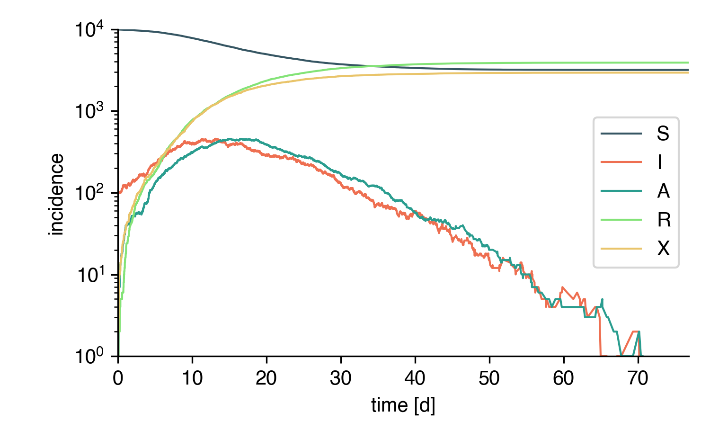
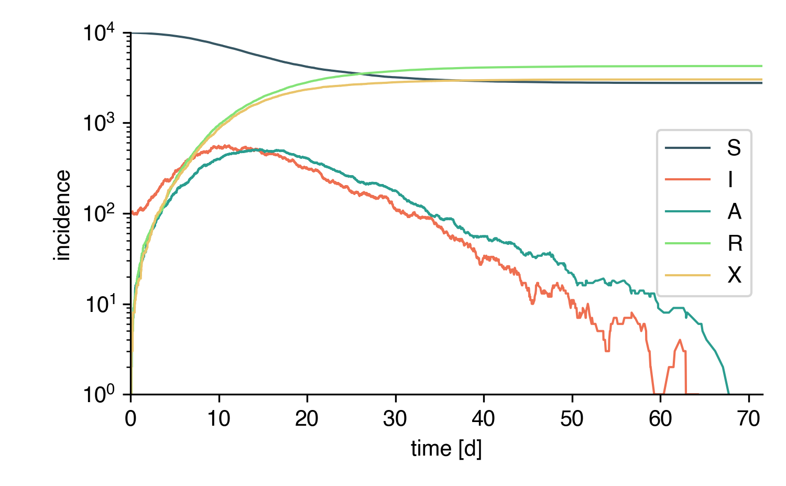
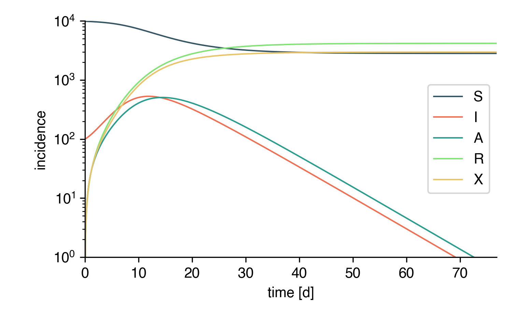

Network/Well-Mixed Simulations
==============================

All models shown up until now ignore the explicit contact
structure between individuals. Such structures can
be introduced using networks where :math:`N` nodes
represent individuals that are connected by links.

These links represent potentially infectious contacts and
can be weighted and/or directed.

Network Example
---------------

Let's assume a toy system where a central individual with id 
``0`` is connected to two other individuals ``1`` and ``2``.
On average, node ``0`` spends 1/3 of their time (say, 8h a day) with individual
``1`` and and 2/3 of their time (16h a day) with individual ``2``.

The network can be defined as follows:

.. code:: python
    
    N = 3
    edge_weight_tuples = [
        (0, 1, 1/3),
        (0, 2, 2/3),
    ]
    directed = False

We want to investigate a scenario in which node ``0`` is initially
infected (in SIR dynamics)
and we're interested to find the probability that node ``1`` has
been infected after every individual has recovered.

First, we have to define the model

.. code:: python

    from epipack import StochasticEpiModel
    S, I, R = list("SIR")

    model = StochasticEpiModel(
                    compartments=[S,I,R],
                    N=N,
                    edge_weight_tuples=edge_weight_tuples,
                    directed=directed,
                )

Of course, we need to define infection and recovery processes.
Infection processes are link transmission processes and
are set like this:

.. code:: python

    infection_rate = 3.0
    model.set_link_transmission_processes([
            ('I', 'S', infection_rate, 'I', 'I'),
        ])

Note that for link transmission processes, the
first compartment of the left hand side of
the reaction equation ``('I', 'S', infection_rate, 'I', 'I')``
`must` be an infecting compartment (the infecting compartment
of this particular reaction, not necessarily ``'I'``) and equal to the
first compartment of the right hand side of the reaction equation.

Also, the ``infection_rate`` represents the transmission
rate *per unit contact*, i.e. per contact with unit weight ``1.0``
and will be scaled with a link's weight to form a
contact-specific infection rate.

Now, we also need to set the node transition processes.

.. code:: python

    recovery_rate = 2.0
    model.set_node_transition_processes([
            ('I', recovery_rate, 'R'),
        ])

Of course, before we can do anything we have to define
the initial conditions. Initial conditions are either set
randomly like this:

.. code:: python

    model.set_random_initial_conditions({S: N-1, I: 1})

Yet, we said that we wanted specific initial conditions.
For a `StochasticEpiModel`, we have to set them as a numpy
array that carries the initial compartment id for every
node.

.. code:: python

    initial_node_statuses = np.array([
            model.get_compartment_id(I),
            model.get_compartment_id(S),
            model.get_compartment_id(S),
        ])
    model.set_node_statuses(initial_node_statuses)
    
Of course, nothing stops us to set this array more
easily, because we know the compartment ids from the
compartment list as :math:`C_S=0`, :math:`C_I=1`, and
:math:`C_R=2`, such that 

.. code:: python

    initial_node_statuses = np.zeros(N,dtype=int)
    initial_node_statuses[0] = 1
    model.set_node_statuses(initial_node_statuses)

Finally, we simulate this system ten thousand times 
and count how often node ``1`` became infected.

.. code:: python

    N_meas = 10000
    N_inf = 0
    for meas in range(N_meas):
        model.set_node_statuses(initial_node_statuses)
        model.simulate(tmax=1e300)
        if model.node_status[1] == model.get_compartment_id(R):
            N_inf += 1

    print("Node 1 has been infected in", N_inf/N_meas*100, "% of the measurements").

And this is the output:

.. code::

    Node 1 has been infected in 33.21 % of the measurements.

Assuming the dimension of time to be :math:`[t] = 1/\mathrm{d}`,
the link :math:`(0,1,1/3)` is associated with
infection rate 

.. math::

    \eta = (1/3)\times 3/\mathrm{d} = 1/\mathrm{d}

such that a duration :math:`\tau_I` until this
particular infection takes place is
distributed according to pdf

.. math::
    
    f_I(\tau_I) = \eta\exp(-\eta\tau_I).

The infectious period of node ``0`` is distributed as

.. math::
    
    f_R(\tau_R) = \rho\exp(-\rho\tau_R)
 
with :math:`\rho=2/\mathrm{d}`. The probability that
node 1 became infected is equal to the probability
that a sample :math:`\tau_I` is of lower value than 
a sample :math:`\tau_R`, i.e. we need to compute

.. math::

    P_1[\tau_I < \tau_R] &= \int\limits_0^\infty d\tau_R\, f_R(\tau_R) \int\limits_0^{\tau_R}d\tau_I\, f_I(\tau_I) \\
                       &= \int\limits_0^\infty d\tau_R\, \rho\exp(-\rho\tau_R)\left[1-\exp(-\eta\tau_R)\right]\\
                       &= 1-\frac{\rho}{\rho+\eta}\\
                       &= 1/3

which is approximately equal to our simulation result.

We can do the same for the second link :math:`(0, 2,2/3)`
that has link-specific infection rate :math:`\eta=2/\mathrm{d}`
and thus will have been infected in 

.. math::

    P_2[\tau_I < \tau_R] = 1/2
 
of the simulations. Adjusting the code above to count 
the infections of node 2, we obtain

.. code::

    node 2 has been infected in 50.023 % of the measurements.

We can also measure the mean number of secondary infections of
node ``0`` (i.e. its reproduction number):

.. code:: python

    N_meas = 10000
    N_inf = 0
    reproduction_number = 0
    for meas in range(N_meas):
        model.set_node_statuses(initial_node_statuses)
        t, result = model.simulate(tmax=1e300)
        # the number of secondary infections is given
        # by the number of recovereds at the end of the
        # simulation (minus the initial seed).
        reproduction_number += (1/N_meas) * (result['R'][-1] - 1)

    print("Node 0 has infected", reproduction_number, "neighbors on average.")

We obtain:

.. code::

    Node 0 has infected 0.8373 neighbors on average.

We have 3 possible outcomes: zero nodes have been infected,
one node has been infected, and two nodes have been infected.
The probability that 0 nodes have been infected is given by the probability
that node 1 has `not` been infected `and` node 2 has `not` been infected as

.. math::

    \Pi_0 = (1-P_1) \times (1-P_2) = 1/3.

The probability that 2 nodes have been infected is given by the probability
that node 1 has been infected `and` node 2 has been infected, which is

.. math::

    \Pi_2 = P_1 \times P_2 = 1/6.

Because these probabilities have to sum to :math:`\Pi_0+\Pi_1+\Pi_2=1` we
know immediately that :math:`\Pi_1 = 1/2`. Nevertheless, let's write it
down from first principles. The probability that 1 node has been 
infected is given by the probability
that node 1 has been infected and node 2 has `not` been infected, *or*
that node 2 has been infected and node 1 has `not` been infected, i.e.

.. math::

    \Pi_1 &= P_1 \times (1-P_2) + P_2 \times (1-P_1)\\
          &= (1/3) \times (1/2) + (1/2) \times (2/3)\\
          &= 1/2.

Consequently, the expected reproduction number of node 0 is given as

.. math::

    \left<\mathcal R_0 \right> &= 0\times \Pi_0 + 1 \times \Pi_1 + 2 \times \Pi_2 \\
                               &= 1/2 + 2 \times (1/6)\\
                               &= 5/6.

which matches our simulation result.

And this is the entire script for copy/paste:

.. code:: python 

    from epipack import StochasticEpiModel
    import numpy as np

    N = 3
    edge_weight_tuples = [
        (0, 1, 1/3),
        (0, 2, 2/3),
    ]
    directed = False

    S, I, R = list("SIR")

    model = StochasticEpiModel(
                    compartments=[S,I,R],
                    N=N,
                    edge_weight_tuples=edge_weight_tuples,
                    directed=directed,
                )

    infection_rate = 3.0
    model.set_link_transmission_processes([
            ('I', 'S', infection_rate, 'I', 'I'),
        ])

    recovery_rate = 2.0
    model.set_node_transition_processes([
            ('I', recovery_rate, 'R'),
        ])

    model.set_random_initial_conditions({S: N-1, I: 1})

    initial_node_statuses = np.array([
            model.get_compartment_id(I),
            model.get_compartment_id(S),
            model.get_compartment_id(S),
        ])
    model.set_node_statuses(initial_node_statuses)
    
    initial_node_statuses = np.zeros(N,dtype=int)
    initial_node_statuses[0] = 1
    model.set_node_statuses(initial_node_statuses)

    N_meas = 10000
    N_inf = 0
    N_inf_node_2 = 0
    for meas in range(N_meas):
        model.set_node_statuses(initial_node_statuses)
        model.simulate(tmax=1e300)
        if model.node_status[1] == model.get_compartment_id(R):
            N_inf += 1
        if model.node_status[2] == model.get_compartment_id(R):
            N_inf_node_2 += 1

    print("Node 1 has been infected in", N_inf/N_meas*100, "% of the measurements.")
    print("Node 2 has been infected in", N_inf_node_2/N_meas*100, "% of the measurements.")

    N_meas = 10000
    N_inf = 0
    reproduction_number = 0
    for meas in range(N_meas):
        model.set_node_statuses(initial_node_statuses)
        t, result = model.simulate(tmax=1e300)
        reproduction_number += result['R'][-1] -1 

    print("Node 0 has infected", reproduction_number/N_meas, "neighbors on average.")
    
Conditional Transmission Processes
----------------------------------

In order to simulate processes such as contact tracing, `epipack` offers the possibility
to define conditional transmission processes that are executed for each
neighbor of a focal node when this focal node changes compartments.

Let's simulate an SAIRX system on a random graph.
This system is defined as follows:

Susceptibles `S` can be infected both by symptomatic
infectious `I` and asymptomatic infectious `A`, becoming either
symptomatic infectious `I` or asymptomatic infectious `A`
themselves. We also assume that infectious individuals
are quarantined with a quarantine rate at which
each of their contacts will be traced and isolated
with probability `p` if they're symptomatic infectious
themselves.

Processes
~~~~~~~~~

The node transition processes are given as

.. code:: python

    node_transition = [
        ('I', recovery_rate, 'R'),
        ('A', recovery_rate, 'R'),
        ('I', quarantine_rate, 'X'),
    ]

Here, we assume that both `I` and `A`
individuals remain infectious for a
period of mean equal length.

Also, we define transmission processes
where we assume that `A` individuals are only  
half as infectious as `I` individuals and that
30% of all infections result in an `A` individual.

.. code:: python

    link_transmission = [
        ('I', 'S', infection_rate*0.7, 'I', 'I'),
        ('I', 'S', infection_rate*0.3, 'I', 'A'),
        ('A', 'S', 0.5*infection_rate*0.7, 'I', 'I'),
        ('A', 'S', 0.5*infection_rate*0.3, 'I', 'A'),
    ]

Now, we also said that with probability `p`,
neighbors of quarantined individuals shall be isolated, too,
if they're infectious. Therefore, we introduce the following
conditional transmission process

.. code:: python

    conditional_transmission = {
        ('I', '->', 'X') : [
                ('X', 'I', p, 'X', 'X'),
            ]
    }

Every neighbor of a node that transitions from `I` to `X`
will transition to `X` themselves with probability `p`.

Note that generally speaking, a single one of multiple possible 
transmission processes could happen to each `I` neighbor.
E.g. we could define that every `I`-neighbor of an `X`-transitioned
focal node could additionally be isolated in a `T` (traced)
compartment with probability `q` which could model a situation 
in which a fraction `q` of all contacts are informed of a focal node's
positive infection and isolate themselves without being counted
in the `X` compartment. In this case, the conditional transmission
processes would be formulated as 

.. code:: python

    conditional_transmission = {
        ('I', '->', 'X') : [
                ('X', 'I', p, 'X', 'X'),
                ('X', 'I', q, 'X', 'T'),
            ]
    }

Here, every neighbor of a node that transitions from `I` to `X`
will either transition to `X` (with probability `p`),
transition to `T` (with probability `q`) or stay in compartment `I`
(with probability `1-p-q`). Note that the last event
will always be added explicitly and automatically if not set manually.

These kinds of transmission rules have strict formatting
rules that are explained in detail in section :ref:`dev-processes`.

Setup
~~~~~

Let's define links based on a random graph. 

.. code:: python

    import networkx as nx

    k0 = 50
    N = int(1e4)
    edges = [ (e[0], e[1], 1.0) for e in \
              nx.fast_gnp_random_graph(N,k0/(N-1)).edges() ]

And the epidemiological parameters

.. code:: python
    
    recovery_rate = 1/5
    quarantine_rate = 1/5

    Reff = 2.0 
    infection_rate = Reff * (recovery_rate + quarantine_rate) / k0

    p = 0.25

    compartments = list("SIARX")

Now, the processes

.. code:: python

    node_transition = [
        ('I', recovery_rate, 'R'),
        ('A', recovery_rate, 'R'),
        ('I', quarantine_rate, 'X'),
    ]

    link_transmission = [
        ('I', 'S', infection_rate*0.7, 'I', 'I'),
        ('I', 'S', infection_rate*0.3, 'I', 'A'),
        ('A', 'S', 0.5*infection_rate*0.7, 'A', 'I'),
        ('A', 'S', 0.5*infection_rate*0.3, 'A', 'A'),
    ]

    conditional_transmission = {
        ('I', '->', 'X') : [
                ('X', 'I', p, 'X', 'X'),
            ]
    }

And finally, the model with ininital conditions of 100
symptomatic infectious individuals.

.. code:: python

    model = StochasticEpiModel(
               compartments=compartments,
               N=N,
               edge_weight_tuples=edges
               )\
           .set_link_transmission_processes(link_transmission)\
           .set_node_transition_processes(node_transition)\
           .set_conditional_link_transmission_processes(conditional_transmission)\
           .set_random_initial_conditions({
                                           'S': N-100,
                                           'I': 100
                                          })

Finally, simulate the whole thing:

.. code:: python

    t, result = model.simulate(40)

|network-simulation|

Well-Mixed Systems
------------------

In principle, `EpiModel` and `SymbolicEpiModel` both offer
similar comfortable frameworks to simulate well-mixed systems
stochastically with their ``simulate()`` method. Yet,
things like conditional transmission processes cannot 
be simulated.

Using, `StochasticEpiModel` we can tell the model to assume
well-mixed contact structure with mean contact number :math:`k_0`.
This means that StochasticEpiModel will assume that every node
has :math:`k_0` neighbors at every time and when a node
reacts in a (possibly conditional) link transmission, :math:`k_0`
neighbors are sampled from the remaining node set to represent
this node's neighbors at the current moment. Then, one of those
sampled neighbors is chosen for a reaction (for a conditional
link transmission, all neighbors are iterated).

It's simple enough to adjust the model defined above to run
on a well-mixed model. Simply re-define the model as well-mixed
with

.. code:: python

    model.set_well_mixed(N, k0)

or initiate the model as a well-mixed model:

.. code:: python

    model = StochasticEpiModel(
               compartments=compartments,
               N=N,
               well_mixed_mean_contact_number=k0
               )
 
This is a simulation of the same model on a well-mixed system:

|well-mixed-simulation|

We can compare the whole thing to a deterministic implementation 
of a similar model. To this end, we adjust the conditional link
transmission rate to be reformulated as a transmission process.
The contact tracing mechanism can be approximated by the following
reaction equation

.. math::

    I \stackrel{\kappa p k_0 I/N}{\longrightarrow} X

that can be written as 

.. math::

    I + I \stackrel{\kappa p k_0}{\longrightarrow} I + X

The motivation here is as follows.

Symptomatic infectious individuals `I` are quarantined with rate :math:`\kappa`,
i.e. :math:`\kappa\times I` individuals are isolated per unit time.
A focal `I` individual has contact to :math:`k_0\times I/N` of 
such infecteds on average and on average, it's going to be traced
by a fraction :math:`p` of those contacts. In total, the tracing
rate is therefore equal to :math:`\kappa p k_0 I/N`
(Note that the mathematically more rigorous derivation 
is a bit more tedious).

Hence, we define the equivalent deterministic model as

.. code:: python

    link_transmission = [
        ('I', 'S', k0*infection_rate*0.7, 'I', 'I'),
        ('I', 'S', k0*infection_rate*0.3, 'I', 'A'),
        ('A', 'S', k0*0.5*infection_rate*0.7, 'A', 'I'),
        ('A', 'S', k0*0.5*infection_rate*0.3, 'A', 'A'),
        ('I', 'I', quarantine_rate*k0*p, 'I', 'X'),
    ]

    model = EpiModel(
               compartments=compartments,
               initial_population_size=N,
               )\
           .set_processes(node_transition + link_transmission)\
           .set_initial_conditions({
                                       'S': N-100,
                                       'I': 100
                                   })
    t = np.linspace(0,100,1000)
    result = model.integrate(t)

while keeping everything else as it is.

And this is the result:

|deterministic-simulation| 

