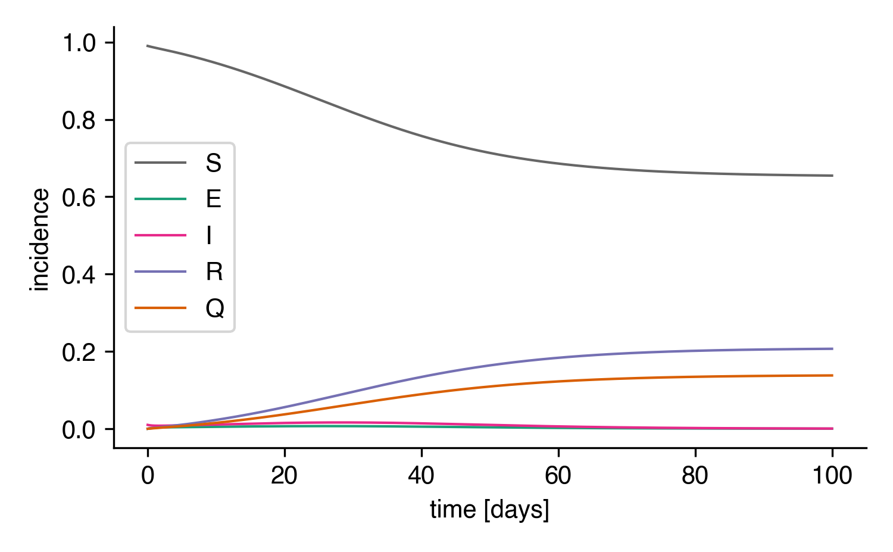
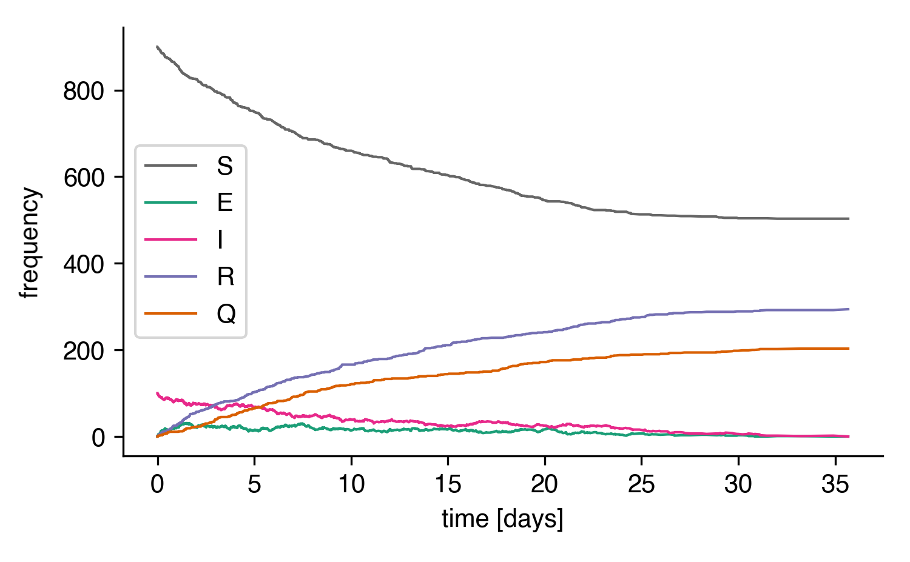
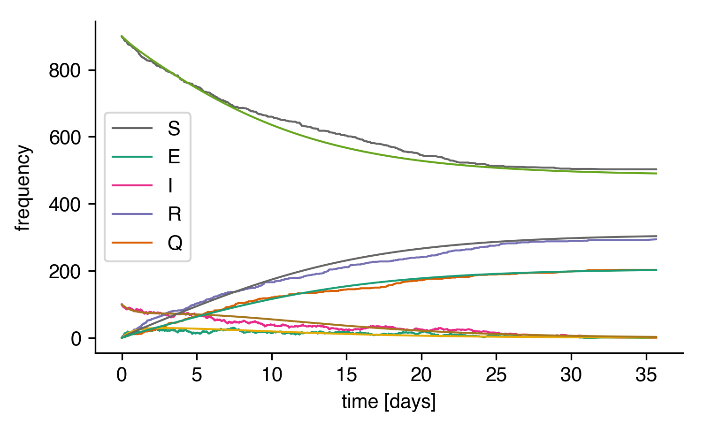
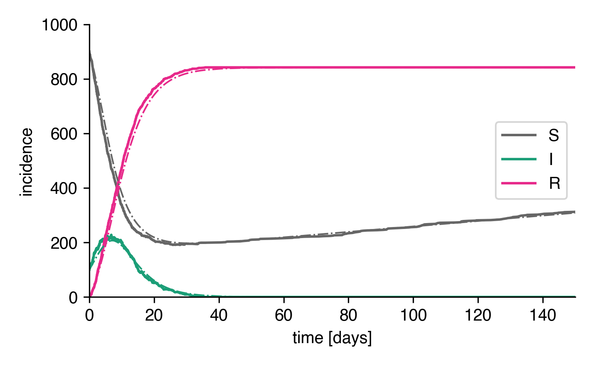
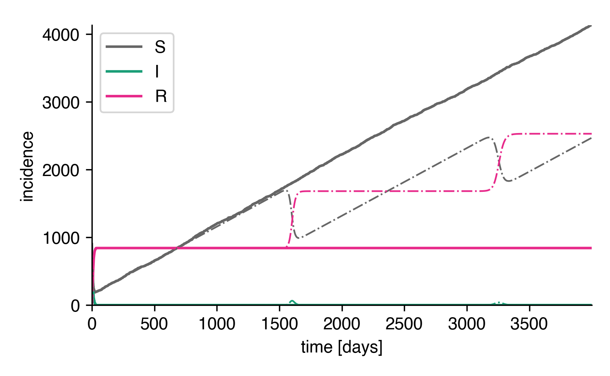
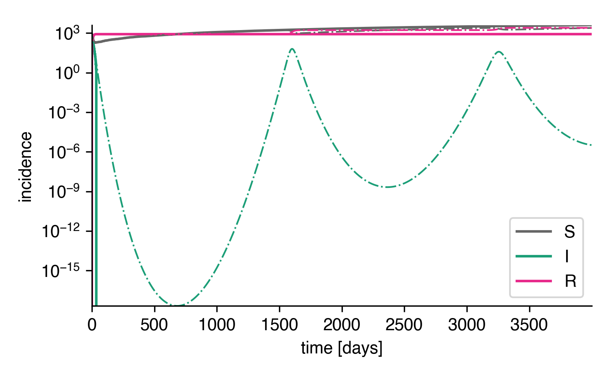
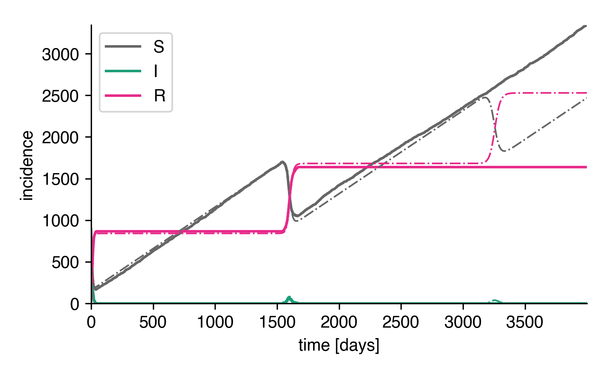
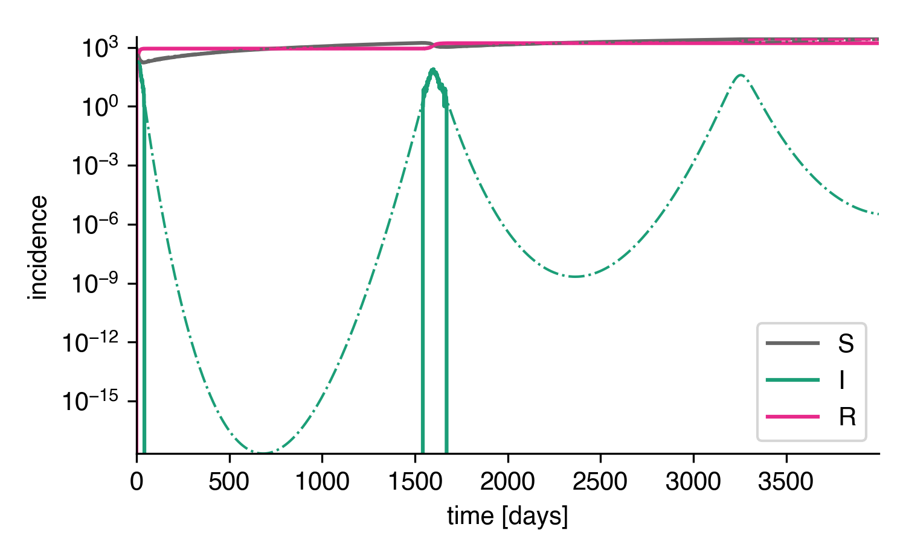

Numeric Models
==============

A Simple Example
----------------

Let's say we want to define a (S)usceptible, (E)xposed,
(I)nfected, (R)ecovered system
where symptomatic individuals are (Q)uarantined
with a quarantine rate :math:`\kappa`.

The reaction equations read

.. math::

    S + I &\stackrel{\alpha}{\longrightarrow} E + I\\
    E &\stackrel{\omega}{\longrightarrow} I\\
    I &\stackrel{\beta}{\longrightarrow} R\\
    I &\stackrel{\kappa}{\longrightarrow} Q,

i.e. symptomatic infecteds infect susceptibles upon contact with rate :math:`\alpha`,
who become then exposed. Exposed individuals become symptomatically infected and 
infectious with rate :math:`\omega`, symptomatic infecteds recovert with rate
:math:`\beta` or are discovered and quarantined with rate :math:`\kappa`.

The first thing we need to do is to set up a model with the right compartments
using the base class :class:`epipack.numeric_epi_models.EpiModel`.

.. code:: python

    import epipack as epk

    S, E, I, R, Q = list("SEIRQ")
    model = epk.EpiModel(compartments=[S,E,I,R,Q])

Automatically, the model maps compartments to indices in a compartment
vector :math:`Y=(S,E,I,R,Q)`. We can check that

.. code:: python

    >>> [ model.get_compartment_id(C) for C in [S, E, I, R, Q]]
    [0, 1, 2, 3, 4]

We can also get a compartment by index.

.. code:: python

    >>> [ model.get_compartment(iC) for iC in range(5) ]
    ["S", "E", "I", "R", "Q"]

Now, let's define some rate values in units of 1 per days and set
the reaction processes

.. code:: python

    infection_rate = 1/2
    recovery_rate = 1/4
    quarantine_rate = 1/6
    symptomatic_rate = 1

    model.set_processes([
        # S + I (alpha)-> E + I
        (S, I, infection_rate, E, I),
        
        # E (omega)-> I
        (E, symptomatic_rate, I),

        # I (beta)-> R
        (I, recovery_rate, R),

        # I (kappa)-> Q
        (I, quarantine_rate, Q),
    ])

Let's say that initially, we have 1% infecteds.

.. code:: python

    I0 = 0.01
    model.set_initial_conditions({S: 1-I0, I: I0})

`epipack` assumes that all compartments that are not explicitly set
have an initial condition of `Y_i = 0`.

Now, we can integrate the ODEs and plot the result

.. code:: python

    import numpy as np
    import matplotlib.pyplot as plt

    t = np.linspace(0,100,1000)
    result = model.integrate(t)

    plt.figure()
    for compartment, incidence in result.items():
        plt.plot(t, incidence, label=compartment)

    plt.xlabel('time [days]')
    plt.ylabel('incidence')
    plt.legend()
    plt.show()

    The integrated SEIRQ model.

Note that we do not have to use ``model.set_processes``.
We can be more explicit by using 

- ``model.add_transition_processes()`` (processes :math:`Y_i\rightarrow Y_j`, :math:`\varnothing \rightarrow Y_j`, :math:`Y_i \rightarrow \varnothing`),
- ``model.add_transmission_processes()`` (processes :math:`Y_i+Y_j\rightarrow Y_k+Y_\ell`),
- ``model.add_fission_processes()`` (processes :math:`Y_i\rightarrow Y_j+Y_k`),
- ``model.add_fusion_processes()`` (processes :math:`Y_i+Y_j\rightarrow Y_k`),

Controlled Definition with Events
---------------------------------

Setting up a model using reaction equations comes
with the comfort of not having to worry about symmetry
in the system. Yet, it also takes away control to some
extent. ``EpiModel`` is an event-based model which means
that internally, processes are saved as events that
take place with a rate and influence the system state
by de-/increasing integer compartment counts.

We can take back control by defining the events ourselves.
An event is defined by a list of compartments that couple,
a rate, and a list of compartment count changes.
For coupled, i.e. quadratic terms, we define

.. code:: python

    model.set_quadratic_events([
        ( (S, I),
          infection_rate,
          [ (S, -1), (E, +1) ]
        ),
    ])

You should read that as follows: The set of all
quadratic events is given by a single infection event.
In that event, compartments ``S`` and ``I`` couple and react
with rate ``infection_rate``. When such an event takes place,
the count of susceptibles ``S`` decreases by one and the
count of exposed increases by one.

We can define linear events in a similar manner

.. code:: python

    model.set_linear_events([
        # E (omega)-> I
        (  (E,),
           symptomatic_rate,
           [ (E, -1), (I, +1)],
        ),
        # I (beta)-> R
        (  (I,),
           recovery_rate,
           [ (I, -1), (R, +1)],
        ),
        # I (kappa)-> Q
        (  (I,),
           quarantine_rate,
           [ (I, -1), (Q, +1)],
        ),
    ])

A model that's defined in this way is in every way equal to the model
defined above.

Stochastic Simulations
----------------------

From how events are defined, stochastic simulations are
straight-forward to set up: We use Gillespie's stochastic
simulation algorithm (SSA) where all events are collected
in an event set :math:`E` and associated with rate
:math:`\lambda_e` (with :math:`e\in E`). An event is also
associated with a state change vector :math:`\Delta Y^{(e)}`, for
instance :math:`\Delta Y^{(e)}=(-1,+1,0,0,0)` for the event
:math:`S+I\rightarrow E+I`. At each time
point, a time leap :math:`\tau` is sampled from

.. math::

    \tau \sim \mathcal E\left(\sum_{e\in E}\lambda_e\right)

where :math:`\mathcal E(\Lambda)` is an exponential distribution
with mean :math:`\Lambda^{-1}`. Subsequently, an event :math:`e`
takes place with probability

.. math::

    p_e = \frac{\lambda_e}{\sum_{e\in E}\lambda_e}

by setting

.. math::

    Y(t+\tau) = Y(t) + \Delta Y^{(e)}.

We don't have to do much to simulate. We set up the model with an
integer initial population size.

.. code:: python

    N = 1000
    I0 = 100
    model = epk.EpiModel([S,E,I,R,Q],initial_population_size=N)
    model.set_processes([
        (S, I, infection_rate, E, I),
        (E, symptomatic_rate, I),
        (I, recovery_rate, R),
        (I, quarantine_rate, Q),
    ])
    model.set_initial_conditions({S: N-I0, I: I0})

And simply simulate until :math:`t=100\mathrm{d}`.

.. code:: python

    t, result = model.simulate(100)

 
and plot the result

.. code:: python

    plt.figure()
    for compartment, incidence in result.items():
        plt.plot(t, incidence, label=compartment)

    plt.xlabel('time [days]')
    plt.ylabel('incidence')
    plt.legend()

    A stochastic simulation of the SEIRQ model.

Let's compare the whole thing to the result of the integrated ODEs:

.. code:: python

    tt = np.linspace(0,100,1000)
    result_int = model.integrate(tt)

    for compartment, incidence in result_int.items():
        plt.plot(tt, incidence)

    Stochastic simulation of the SEIRQ model compared 
    to the integrated ODE system.

Dynamically Changing Population Size
------------------------------------

Let's come back to the model defined in the introduction:

.. math::

    S + I \stackrel{\alpha}{\longrightarrow} I + I
    I \stackrel{\beta}{\longrightarrow} R.
    \varnothing \stackrel{\gamma}{\longrightarrow} S.

It's a modified SIR system where new susceptibles 
are born with constant rate :math:`\gamma`.

Let's set up an ``EpiModel``.

.. code:: python

    import epipack as epk

    N = 1000
    S, I, R = list("SIR")
    model = epk.EpiModel([S,I,R],
                         initial_population_size=N)

    alpha = 1/2
    beta = 1/4
    gamma = 1
    I0 = 100

    model.set_processes([
            (S, I, alpha, I, I),
            (I, beta, R),
            (None, gamma, S),
        ])

Note that we're hit the following warnings:

    UserWarning: This model has processes with a fluctuating number of agents.
        Consider correcting the rates dynamically with the attribute
        correct_for_dynamical_population_size = True
    UserWarning: events do not sum to zero for each column: 1.0

`epipack` noticed that the population size will not stay constant.
If this is intended, reaction rates of quadratic couplings will
have to be rescaled by the dynamically changed population size.

Tell the model to do this by setting

.. code:: python

    model.correct_for_dynamical_population_size = True

Ideally, you already knew that beforehand, which is why you want to initiate
the model with this behavior:

.. code:: python

    model = epk.EpiModel([S,I,R],
                         initial_population_size=N,
                         correct_for_dynamical_population_size=True,
                         )

Now, we can integrate the ODEs and simulate the system

.. code:: python

    t, result_sim = model.simulate(4000)
    result_int = model.integrate(t)

This is the initial development:

    Stochastic simulation and ODE integration of the SIR-birth model.

As we can see, ODE solution and stochastic solution line up relatively well.
How does it look for longer times though?

    Longer times.

A new effect! Apparently, a second and a third wave rapidly depletes 
the grown susceptible population in the deterministic system. In order to
understand what's going on, we can take a look at the curves on a log scale.

    Longer times with log scale.

In the stochastic system, the number of infected individuals reaches :math:`I=1`
and is then trapped in the absorbing state :math:`I=0`, while the deterministic system 
reaches incredibly low values of :math:`I` until there are enough susceptible
individuals such that another waves may occur. In reality, a value of 
:math:`I=10^{-15}` would not result in 

We can, however, assume that reimports of single infecteds can trigger second waves
when there are enough susceptible individuals. Such a behavior may be mimicked
by adding another birth process with a small rate and simulating again.

.. code:: python

    model.add_transition_processes([
            (None, 1e-3, I),
        ])
    t, result_sim = model.simulate(4000)

As we can see, doing so reconciles the stochastic system with the deterministic
system, at least qualitatively. The first peak is reproduced. The second
peak is not reproduced because no reimport happened up to time :math:`t=4000\mathrm{d}`
in this particular simulation.

    Stochastic system with reimports.

    Stochastic system with reimports on a log scale.
