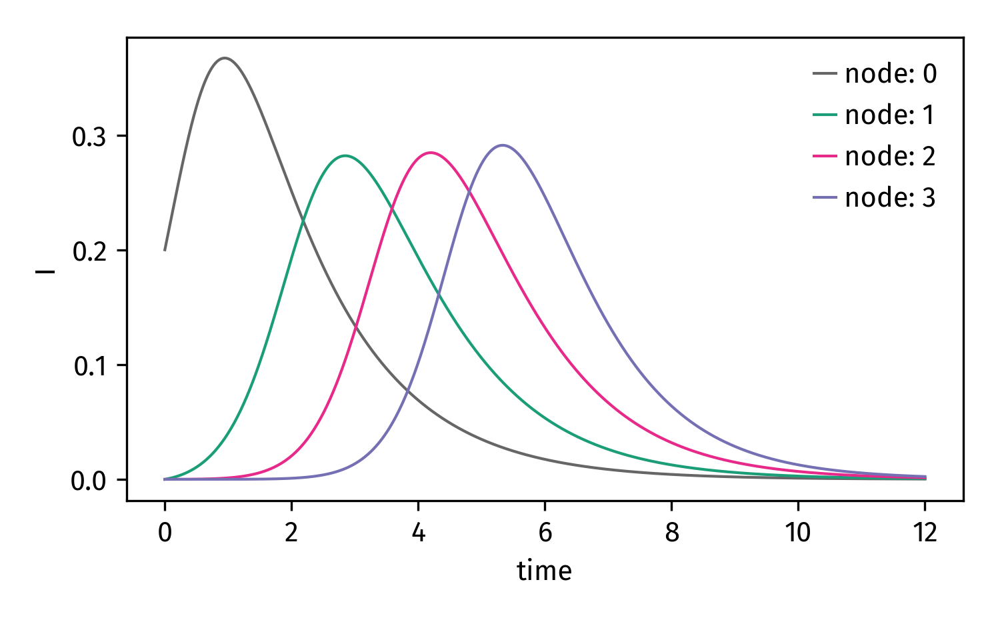

Reaction-Diffusion Systems
--------------------------

In reaction-diffusion systems, reaction processes are defined
per location for a finite set of `N` locations that are connected
via links in a network. Through these links, reactions between
locations can take place. This means that if we assume a reactive
system of `C` compartments per location, the system can be described
using an instance of :class:`epipack.numeric_matrix_epi_models.MatrixEpiModel`
with :math:`N\times C` compartments: Each compartment is identified
by a location and its epidemiological description.

.. note::

    Usually, reaction diffusion equations are somewhat computationally
    heavy, which is why for research purposes you should consider
    other solutions or writing custom code. Nevertheless, ``epipack``'s
    philosophy of fast prototyping comes in handy, so if you just aim
    at finding the right model and visualize it in a small system,
    the following tutorial might help.

Networks
========

One such example might be an SIR process taking place in different locations
on earth which are connected via the air traffic network. In this case,
the reaction equations read

.. math::

    S_u + I_u \stackrel{\eta}{\longrightarrow} 2I_u

    I_u \stackrel{\rho}{\longrightarrow} R_u

    X_u \stackrel{w_{uv}}{\longrightarrow} X_v

Here, :math:`X_u` represents a compartment :math:`X\in\{S,I,R\}` 
at location :math:`u` with population size :math:`N_u`,
and :math:`w_{uv}` represents a transition rate
of an individual from location `u` to location `v`.

In this picture, the total number of individuals traveling
in the network remains constant and it is assumed 
that the population size per location is constant for all nodes,
as well, if :math:`w_{uv}=w_{vu}`. The last equation 
describes an edge-centric random walk, which is associated with
a uniform equilibrium concentration.

Let's assume we have an undirected network :math:`A_{uv}` and
the transition rate per link is given as :math:`w_{uv}=\gamma A_{uv}`.

We want to define a chain here:

.. code:: python

    from epipack import MatrixEpiModel

    N = 4
    nodes = list(range(N))
    links = [ (u,u+1,1.0) for u in range(N-1) ]
    
    base_compartments = list("SIR")
    compartments = [
            (node, comp) for node in nodes for comp in base_compartments
        ]
    model = MatrixEpiModel(compartments)

See that instead of using strings for compartments, we're using a tuple
that contains the node and the compartment type. This works because 
tuples are `hashable`.

Now we want to define our reaction processes

.. code:: python

    infection_rate = 3
    recovery_rate = 1
    mobility_rate = 0.05

    quadratic_processes = []
    linear_processes = []

    for node in nodes:
        quadratic_processes.append(
                (  (node, "S"), (node, "I"), infection_rate, (node, "I"), (node, "I") ),
            )

        linear_processes.append(
                  ( (node, "I"), recovery_rate, (node, "R") ) 
            )

    for u, v, w in links:
        for C in base_compartments:

            linear_processes.extend([
                      ( (u, C), w*mobility_rate, (v, C) ),
                      ( (v, C), w*mobility_rate, (u, C) ),
                ])

See that due to symmetry, we have to set transition
reactions for :math:`u\rightarrow v` as well as :math:`v\rightarrow u`
for the same link.

Finally, we pass the processes to the model to be converted

.. code:: python

    model.set_processes(quadratic_processes+linear_processes)

All that's left to do is to define initial conditions. Let's
say we do this by assuming 20 percent of the population
on the first node is infected.

.. code:: python

    initial_conditions = { ( node, "S" ): 1.0 for node in nodes } 
    initial_conditions[(nodes[0], "S")] = 0.8
    initial_conditions[(nodes[0], "I")] = 0.2
    model.set_initial_conditions(initial_conditions,allow_nonzero_column_sums=True)

Note that we pass the ``allow_nonzero_column_sums=True`` flag to suppress a warning
that the initial conditions do not sum up to unity.

Now we can integrate and plot the ``I`` compartment for each node

.. code:: python
    
    # set compartments for which you want to obtain the
    # result
    plot_compartments = [ (node, "I") for node in nodes ]

    # integrate
    import numpy as np
    t = np.linspace(0,12,1000)    
    result = model.integrate(t,return_compartments=plot_compartments)

    # plot result
    import matplotlib.pyplot as plt
    plt.figure()

    for (node, _), concentration in result.items():
        plt.plot(t, concentration, label=str(node))

    plt.xlabel("time")
    plt.ylabel("I")
    plt.legend()
    plt.show()

Finally:

.. note::
    
    As stated above, nodes are assumed to carry uniform equilibrium
    density of random walkers (as is the case in edge-centric
    random walks).

    If, instead, you want to assume that nodes have an equilibrium
    density proportional to their total in-/outflux (weighted degree),
    you have to rescale the links (which are then equal to transition
    probabilities and asymmetrical).

    For further info, see the supplementary material
    of https://science.sciencemag.org/content/342/6164/1337.figures-only 

Visualization
=============

Reaction-diffusion systems are fun to watch unfold. Because we know this,
``epipack`` provides a visualization function for reaction diffusion systems:
:func:`epipack.vis.visualize_reaction_diffusion`.

Let's create a modular hierarchical network from the cMHRN_ package and style
it

.. code:: python

    import networkx as nx
    import netwulf as nw
    import cMHRN

    # load edges from txt file and construct Graph object
    N, edges = cMHRN.fast_mhrn(8,3,7,0.18,True)
    G = nx.Graph()
    G.add_edges_from(edges)

    # visualize and save visualization
    network, config = nw.visualize(G)
    nw.save("MHRN.json",network,config)

.. code:: python

    # load visualization
    network, config, _  = nw.load("MHRN.json")
    # get the network properties
    N = len(network['nodes'])
    nodes = list(range(N))
    links = [ ( link['source'], link['target'], 1.0 ) for link in network['links'] ]

Subsequently, we set up the model exactly as above.

One thing that you should know is that internally, an instance of
``MatrixEpiModel`` creates a one-dimensional :\math:`N\times C`-long
vector that contains the state of each compartment. In order
for the visualization function to know which entry it should plot for each node,
we have to provide it with the appropriate compartments. To this end, we construct
a list of `N` entries, each entry `i` maps node `i` to the compartment whose
concentration is supposed to be shown for this node.

Here, we want the node to be scaled according to its "I" compartment,
which we expect to take values between ``0`` and ``0.3``:

.. code:: python

    node_compartments = [ (node, "I") for node in nodes ]
    value_extent = [0,0.3]

And finally, we can start the visualization

.. code:: python

    from epipack.vis import visualize_reaction_diffusion
    dt = 0.04
    visualize_reaction_diffusion(model, 
                                 network, 
                                 dt, 
                                 node_compartments, 
                                 value_extent=value_extent,
                                 )

.. video:: ../_static/reac_diff_MHRN.mp4
    :width: 500

Lattices
========

Sometimes, a network is not the structure you want to be looking at.
That's fine, you do you, go for the lattice. However, what is a lattice 
but a network? If you want so simulate/visualize on a lattice, 
simply do everything as described above, but use a lattice network

.. code:: python

    from epipack.vis import visualize_reaction_diffusion, get_grid_layout
    from epipack import get_2D_lattice_network

    N_side = 30
    N = N_side**2
    nodes = range(N)
    links = get_2D_lattice_network(N)
    network = get_grid_layout(N)

Now, set up everything as above and simulate on a lattice:

.. code:: python

    visualize_reaction_diffusion(model, 
                                 network, 
                                 dt, 
                                 node_compartments, 
                                 value_extent=value_extent,
                                 config = {
                                    'draw_nodes_as_rectangles': True,
                                    'draw_links': False,
                                 }
                                 )

.. video:: ../_static/reac_diff_lattice.mp4
    :width: 500

.. _cMHRN: https://github.com/benmaier/cMHRN

