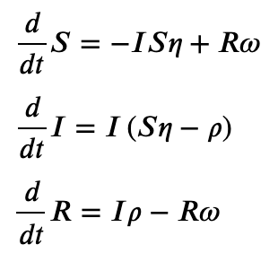
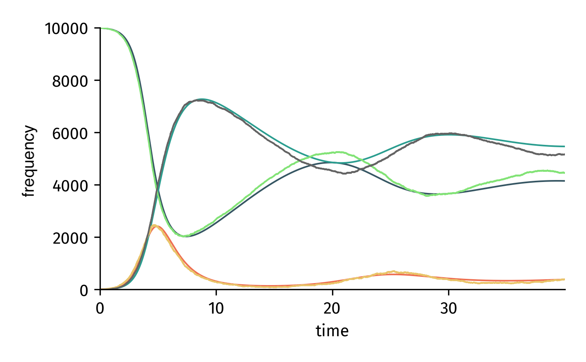

Symbolic Models
===============

Symbolic models are more powerful than pure numeric models.
In fact, they can do everything that an EpiModel can do and more.
Symbolic models are named like that because they are based
on sympy_ symbols (and as such function as a hybrid between
numeric evaluations and computer algebra systems).

Example: SIRS model
-------------------

First, we define all compartments and parameters as
sympy symbols

.. code:: python

    from epipack import SymbolicEpiModel
    import sympy as sy

    S, I, R, eta, rho, omega = sy.symbols("S I R eta rho omega")

With these symbols, we can set up the base model

.. code:: python

    SIRS = SymbolicEpiModel([S,I,R])\
        .set_processes([
            (S, I, eta, I, I),
            (I, rho, R),
            (R, omega, S),
        ])

That's all. Now we can analyze the system analytically.

ODEs
^^^^

Let's begin by looking at the ODEs of the deterministic model.

.. code::

    In [79]: SIRS.ODEs()
    Out[79]:
    [Eq(Derivative(S, t), -I*S*eta + R*omega),
     Eq(Derivative(I, t), I*(S*eta - rho)),
     Eq(Derivative(R, t), I*rho - R*omega)]

In a jupyter notebook, we can display the ODEs with LaTeX.

.. code:: python 

    SIRS.ODEs_jupyter()

Fixed Points and Linear Stability
^^^^^^^^^^^^^^^^^^^^^^^^^^^^^^^^^

Usually, we're interested in fixed points of the system.
You can let sympy find them.

.. code:: python

    SIRS.find_fixed_points()

.. image:: symbolic_media/fixed_points.png

Also, we're interested in the linear stability of these
fixed points. Let's use the fixed point

.. math::

    Y = (\rho / \eta, R\omega/\rho, R)

First, we need to eliminate the unset value :math:`R` by using
the normalization condition

.. math::

    S + I + R = 1\\
    \frac{\eta}{\rho} + R\frac{\omega}{\rho} + R = 1\\
    R = \frac{\eta}{\rho + \omega}.

The linear stability can now be found using the following method

.. code:: python

    >>> SIRS.get_eigenvalues_at_fixed_point({
    ...     S : rho / eta,
    ...     I : eta * omega / rho / (omega + rho),
    ...     R : eta / (omega + rho),
    ... })
    {-omega*(eta**2 + omega*rho + rho**2)/(2*rho*(omega + rho)) - sqrt(omega*(eta**4*omega - 2*eta**2*omega**2*rho - 6*eta**2*omega*rho**2 - 4*eta**2*rho**3 + omega**3*rho**2 + 2*omega**2*rho**3 + omega*rho**4))/(2*rho*(omega + rho)): 1,
     -omega*(eta**2 + omega*rho + rho**2)/(2*rho*(omega + rho)) + sqrt(omega*(eta**4*omega - 2*eta**2*omega**2*rho - 6*eta**2*omega*rho**2 - 4*eta**2*rho**3 + omega**3*rho**2 + 2*omega**2*rho**3 + omega*rho**4))/(2*rho*(omega + rho)): 1,
     0: 1}

The eigenvalues contain parts that can become complex -
explaining the emergence of oscillations in this system.

Of course, the `epidemic threshold` is a central observable
of interest. To find this threshold, we need to compute the linear
stability at the disease free state :math:`Y = (1,0,0)`.

.. code:: python

    >>> SIRS.get_eigenvalues_at_disease_free_state()
    {-omega: 1, eta - rho: 1, 0: 1}

The disease free state therefore becomes unstable 
when :math:`\eta > \rho`, i.e the epidemic threshold
is given as 

.. math::

    \eta / \rho = 1.

Jacobian
^^^^^^^^

In order to analyze linear stability, we need access to the system's
Jacobian that can be found as 

.. code:: python

    >>> SIRS.jacobian()

.. image:: symbolic_media/jacobian.png

Analyze Numerically and Stochastically
--------------------------------------

SymbolicEpiModel inherits all analysis methods from EpiModel.
Hence, we can do everything that we can do with an EpiModel. 
All we need to do is to set numerical parameter values 

.. code:: python

    SIRS.set_parameter_values({eta: 2.5, rho: 1.0, omega:1/14})
    t = np.linspace(0,40,1000)
    result = SIRS.integrate(t)
    
.. code:: python

    N = 10000
    SIRS = SymbolicEpiModel([S,I,R],N)

.. code:: python

    t_sim, result_sim = SIRS.simulate(40)

    Integrated/simulated system based on a SymbolicEpiModel.

Interactive Analysis
--------------------

In jupyter notebooks, a SymbolicEpiModel
can be used with an interactive widget.

Make sure to first run

.. code:: python

    %matplotlib widget

Now we define the model as before, but
as parameters we use the infectious period :math:`\tau`
(instead of the recovery rate :math:`\rho`) and 
the basic reproduction number :math:`R_0 = \eta\tau`.

.. code:: python

    S, I, R, R0, tau, omega = sympy.symbols("S I R R_0 tau omega")

    I0 = 0.01
    model = SymbolicEpiModel([S,I,R])\
                 .set_processes([
                        (S, I, R0/tau, I, I),
                        (I, 1/tau, R),
                        (R, omega, S),
                    ])\
                 .set_initial_conditions({S:1-I0, I:I0})

Now we set parameter
ranges instead of parameter values with
:class:`epipack.interactive.Range` and
:class:`epipack.interactive.LogRange`.

Each parameter value that's associated 
with a range will be rendered as a slider.

We can define these parameters like so:

.. code:: python

    from epipack.interactive import InteractiveIntegrator, Range, LogRange

    parameters = {
        R0: LogRange(min=0.1,max=10,step_count=1000),
        tau: Range(min=0.1,max=10,value=8.0),
        omega: 1/14
    }

And then we just run the integrator.

.. code:: python

    t = np.logspace(-3,2,1000)
    InteractiveIntegrator(model, parameters, t, figsize=(4,4))
 
.. video:: ../_static/interactive_integrator.mp4
    :width: 500

    
Pure ODE Models
---------------

In case you already have an ODE system ready to go, 
you can define it with :class:`epipack.symbolic_epi_models.SymbolicODEModel`
without going through the hassle of converting it
to reaction processes. Simply define the equations
as a list of sympy equation objects:

.. code:: python

    import sympy as sy
    from epipack import SymbolicODEModel
    
    S, I, R, alpha, beta, t = sy.symbols("S I R alpha beta t")

    ODEs = [
        sy.Eq(sy.Derivative(S, t), -alpha*S*I),
        sy.Eq(sy.Derivative(I, t), +alpha*S*I - beta*I),
        sy.Eq(sy.Derivative(R, t), +beta*I),
    ]

    model = SymbolicODEModel(ODEs)

`epipack` infers the compartments automatically. Note
that stochastic simulations are not possible with this
model since events cannot be inferred from ODEs.

.. _`sympy`: https://www.sympy.org/en/index.html
