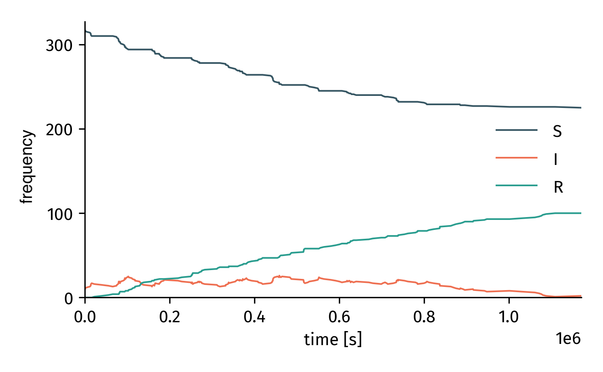

Temporal Networks
=================

`epipack` provides a tiny interface to simulate StochasticEpiModels
on temporal networks, see :mod:`epipack.temporal_networks`.
Note that such simulations are based on the simulation routine
for static networks and therefore numerically correct
but not particularly efficient (the event set is
reset in its entirety every time the network structure changes).

The idea is once again that prototyping should be fast, i.e.
building new models in a flexible manner, leaving simulation
efficiency aside.

Standard epipdemiological models are implemented in tacoma_
which you should use if you want to go for fast simulations.

Temporal Network Objects
------------------------

A temporal network is defined by the following properties

- ``N``: the constant number of nodes in the system
- ``t``: A sorted list containing each time point at which 
  the edge set will be updated
- ``tmax``: A final time that marks the end of the experiment
  (not associated with an edge set update).
- ``edges``: An ordered list of edge sets.

    .. code:: python

        edges = [
            [ (0,1), ... ], # edge set for first timestamp
            [ (2,7), ... ], # edge set for second timestamp
            ...         
        ]
- ``directed``: boolean, whether or not edges in edge set
  are supposed to be symmetric
- ``weighted``: boolean, if ``True``, the edges in the edge
  sets per time stamp are expected to be 3-tuples where the 
  last entry is a float value

    .. code:: python

        edges = [
            [ (0,1,1.0), ... ], # edge set for first timestamp
            [ (2,7,0.5), ... ], # edge set for second timestamp
            ...         
        ]

This is a variant of how temporal networks are defined in tacoma_
(in `tacoma`, more temporal network types are possible, but every one
of them only offers unweighted and undirected edges).

In `epipack`, temporal networks are supposed to be constructed using
the :class:`epipack.temporal_networks.TemporalNetwork` class.

Here's an example:

.. code:: python

    edges = [ [ (0,1) ], [ (0,1), (0,2) ], [] ]
    t = [0,0.5,1.5]
    temporal_network = TemporalNetwork(N=3,edge_lists=edges,t=t,tmax=3.0)

Now we can iterate through the network:

.. code:: python

    for this_edge_list, this_t, next_t in temporal_network:
        if this_t >= 12:
            break
        print("t in [",this_t, next_t,"], edges:", this_edge_list)

And this is the outcome:

.. code::

    t in [ 0 0.5 ], edges: [(0, 1, 1.0)]
    t in [ 0.5 1.5 ], edges: [(0, 1, 1.0), (0, 2, 1.0)]
    t in [ 1.5 3.0 ], edges: []
    t in [ 3.0 3.5 ], edges: [(0, 1, 1.0)]
    t in [ 3.5 4.5 ], edges: [(0, 1, 1.0), (0, 2, 1.0)]
    t in [ 4.5 6.0 ], edges: []
    t in [ 6.0 6.5 ], edges: [(0, 1, 1.0)]
    t in [ 6.5 7.5 ], edges: [(0, 1, 1.0), (0, 2, 1.0)]
    t in [ 7.5 9.0 ], edges: []
    t in [ 9.0 9.5 ], edges: [(0, 1, 1.0)]
    t in [ 9.5 10.5 ], edges: [(0, 1, 1.0), (0, 2, 1.0)]
    t in [ 10.5 12.0 ], edges: []

Two things can be noticed immediately. First, a default edge 
weight of ``1.0`` is added to every node pair of the originally
unweighted network. This is done because StochasticEpiModel
expects weighted edge tuples.
Second, temporal networks are looped indefinitely per default,
which is why we have to break the loop manually. If you don't
want them to loop but to stop the simulation at ``tmax``, pass the keyword
``loop_network=False`` to the constructor

.. code:: python
    
    TemporalNetwork(loop_network=False,*args,**kwargs)

The mean out degree is important to determine how 
fast a virus can spread through the network. You can obtain
its value using the method `mean_out_degree()`.

.. code:: python

    k_out = temporal_network.mean_out_degree()

Construct Temporal Networks with Tacoma
---------------------------------------

tacoma_ offers an extensive temporal network analysis frame work,
such that it makes sense to use it to load temporal networks.
For instance:

.. code:: python

    tn = tc.load_json_taco("~/.tacoma/hs13.taco")
    tn = TemporalNetwork.from_tacoma(tn)

Simulate with StochasticEpiModel
--------------------------------

After loading a temporal network, set up a simulation using
:class:`epipack.temporal_networks.TemporalNetworkSimulation`.

First, let's load a temporal network and define a simple SIR model.

.. code:: python

    # load network
    tn = tc.load_json_taco("~/.tacoma/hs13.taco")
    tn = TemporalNetwork.from_tacoma(tn)

    # compute disease parameters
    k = tn.mean_out_degree()
    R0 = 2.0
    recovery_rate = 1/(2*24*3600)
    infection_rate = R0 * recovery_rate / k

    # define model
    model = StochasticEpiModel(['S','I','R'],N=tn.N)\
                .set_node_transition_processes([
                    ('I', recovery_rate, 'R')
                ])\
                .set_link_transmission_processes([
                    ('I', 'S', infection_rate, 'I', 'I')
                ])\
                .set_random_initial_conditions({
                    'S': tn.N - 10,
                    'I': 10
                })

Now, we can set up a simulation object and simulate the whole thing.

.. code:: python

    sim = TemporalNetworkSimulation(tn, model)
    t, result = sim.simulate(tmax=2*7*24*3600)

    Stochastic simulation on a temporal network.

.. _`tacoma`: http://tacoma.benmaier.org/temporal_networks/temporal_network_classes.html
