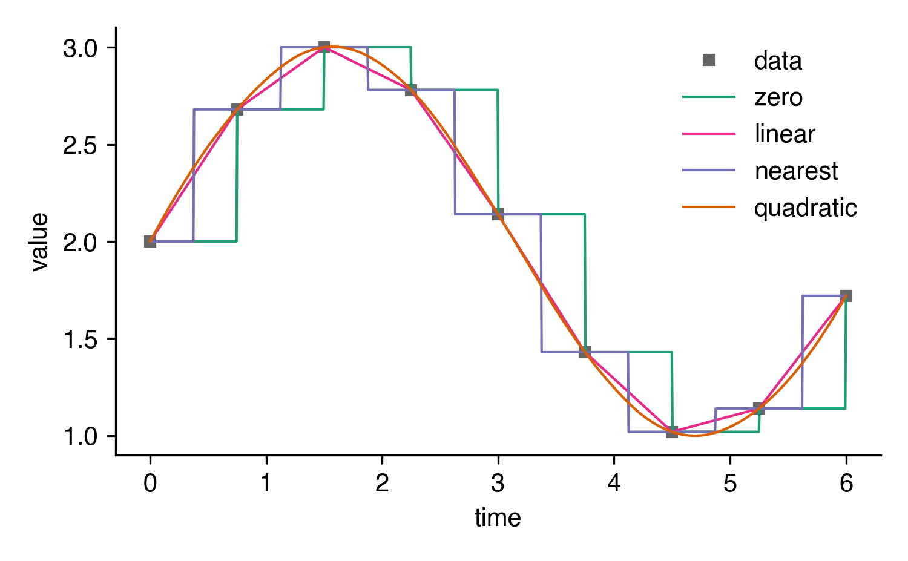
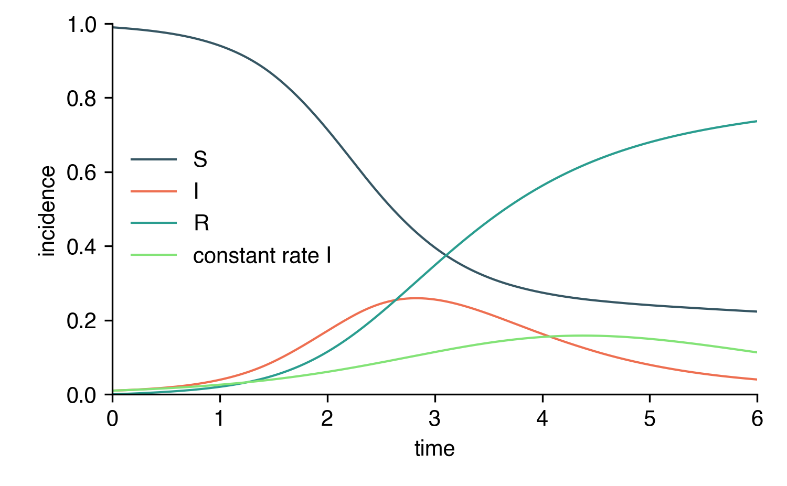
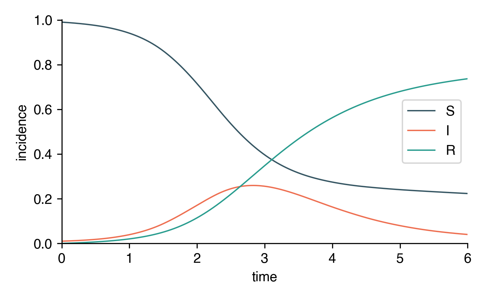

Time-Varying Rates
==================

Many scenarios raise the necessity of incorporating 
temporally changing rates in epidemiological models.
For instance, when containment measures are continuously increased
during the progression of an outbreak, rates such 
as the infection rate will decrease while a quarantine
rate will increase. Other examples include seasonally
changing infection rates.

Systems like this can be easily set up with `epipack`
which will be demonstrated in the following.

Numeric Models
--------------

When defining rates, `EpiModel` explicitly checks 
each rate for a functional dependence. E.g. let's
define a seasonally changing infection rate
and pass it to a model

.. code:: python

    def infection_rate(t,y):
        return 2 + np.sin(t)

    model = EpiModel(list('SIR'))
    model.add_transmission_processes([
            ('S', 'I', infection_rate, 'I', 'I'),
        ])

Epipack automatically incorporates this function
into its integration/simulation framework.

As one can see from the example, a functional rate
takes as input the current time ``t`` and 
a state vector ``y``. The state vector ``y`` (a numpy
array) will be passed to this function during
integration/simulation and contains the current
incidence for every compartment. Considering the example
above, ``y``'s first element corresponds to the `S` compartment,
the second element to the `I` compartment, and the third element
to the `R` compartment. This order is defined by the order 
of the compartment list that was passed to `EpiModel` during
construction.

Tabulated Values
~~~~~~~~~~~~~~~~

In case you're approximating continuous functions with tabulated
values, e.g. when mapping an infection rate to a reduction
in mobility that's only available on a weekly basis, you
can use scipy's interpolation method interp1d.

Assuming we have the following tabulated data

.. code:: python

    data = np.array([
        (0.0,  2.00),
        (0.75, 2.68),
        (1.5,  3.00),
        (2.25, 2.78),
        (3.0,  2.14),
        (3.75, 1.43),
        (4.5,  1.02),
        (5.25, 1.14),
        (6.0,  1.72),
    ])

    times, rates = data[:,0], data[:,1]

we can define our interpolated rate function using ``interp1d``.

.. code:: python

    f = interp1d(times, rates, kind='linear')

    def infection_rate(t,y):
        return f(t)

``interp1d`` offers several different methods of interpolation
including ``'zero'`` in case you want to use step functions.

Here's an illustration of how different ``kind`` values
shape the interpolation:

Here's a complete example script where a
linearly interpolated rate is compared
to a constant rate :math:`\eta = 2`.

.. code:: python

    from epipack import EpiModel
    from scipy.interpolate import interp1d
    from epipack.plottools import plot
    import matplotlib.pyplot as pl
    import numpy as np

    data = np.array([
        (0.0,  2.00),
        (0.75, 2.68),
        (1.5,  3.00),
        (2.25, 2.78),
        (3.0,  2.14),
        (3.75, 1.43),
        (4.5,  1.02),
        (5.25, 1.14),
        (6.0,  1.72),
    ])

    times, rates = data[:,0], data[:,1]

    f = interp1d(times, rates, kind='linear', bounds_error=False)

    def infection_rate(t,y):
        return f(t)

    model = EpiModel(list("SIR"))
    model.set_processes([
            ('S', 'I', infection_rate, 'I', 'I'),
            ('I', 1.0, 'R'),
        ])\
        .set_initial_conditions({'S':0.99,'I':0.01})\

    t = np.linspace(0,6,1000)

    result = model.integrate(t)
    ax = plot(t,result)
    ax.legend(frameon=False)

    model = EpiModel(list("SIR"))
    model.set_processes([
            ('S', 'I', 2.0, 'I', 'I'),
            ('I', 1.0, 'R'),
        ])\
        .set_initial_conditions({'S':0.99,'I':0.01})\

    t = np.linspace(0,6,1000)

    result = model.integrate(t,return_compartments='I')
    ax = plot(t,result,ax=ax,curve_label_format='constant rate {}')
    ax.set_ylim([0,1])
    ax.legend(frameon=False)

    ax.get_figure().savefig('interp_SIR_numeric.png',dpi=300)
    pl.show()

        

Symbolic Models
---------------

For `SymbolicEpiModels`, the symbol ``t`` is reserved for time.
It's simple enough to define rates like this:

.. code:: python

    import sympy
    
    S, I, R, t, rho = sympy.symbols("S I R t rho")

    model = SymbolicEpiModel([S,I,R])
    model.set_processes([
            (S, I, 2+sympy.sin(t), I, I),
            (I, rho, R),
        ])

Interpolation for Tabulated Values
~~~~~~~~~~~~~~~~~~~~~~~~~~~~~~~~~~

Similar to the framework for `EpiModel`, we can define symbolic
interpolation functions. `epipack` comes with its own 
wrapper to define such functions.

.. code:: python

    from epipack.symbolic_epi_models import (
                    get_temporal_interpolation, 
                    SymbolicEpiModel,
                )

    data = np.array([
        (0.0,  2.00),
        (0.75, 2.68),
        (1.5,  3.00),
        (2.25, 2.78),
        (3.0,  2.14),
        (3.75, 1.43),
        (4.5,  1.02),
        (5.25, 1.14),
        (6.0,  1.72),
    ])

    times, rates = data[:,0], data[:,1]

    f = get_temporal_interpolation(times, rates, interpolation_degree=1)

    S, I, R, t, rho = sympy.symbols("S I R t rho")

    model = SymbolicEpiModel([S,I,R])
    model.set_processes([
            (S, I, f, I, I),
            (I, rho, R),
        ])

You can use ``interpolation_degree = 0`` to obtain step functions,
``interpolation_degree = 1`` to obtain linearly interpolated functions,
``interpolation_degree = 2`` for quadrativally interpolated functions
and so forth.

Here's a complete example script:

.. code:: python
    
    from epipack.symbolic_epi_models import (
                        get_temporal_interpolation, 
                        SymbolicEpiModel,
                    )
    import sympy
    from epipack.plottools import plot
    from bfmplot import pl
    import numpy as np

    data = np.array([
        (0.0,  2.00),
        (0.75, 2.68),
        (1.5,  3.00),
        (2.25, 2.78),
        (3.0,  2.14),
        (3.75, 1.43),
        (4.5,  1.02),
        (5.25, 1.14),
        (6.0,  1.72),
    ])

    times, rates = data[:,0], data[:,1]

    f = get_temporal_interpolation(times, rates, interpolation_degree=1)

    S, I, R, t, rho = sympy.symbols("S I R t rho")

    model = SymbolicEpiModel([S,I,R])
    model.set_processes([
            (S, I, f, I, I),
            (I, rho, R),
        ])\
        .set_initial_conditions({S:0.99,I:0.01})\
        .set_parameter_values({rho:1})

    t = np.linspace(0,6,1000)

    result = model.integrate(t)
    ax = plot(t,result)
    ax.legend()
    ax.get_figure().savefig('interp_SIR_symbolic.png',dpi=300)
    pl.show()

